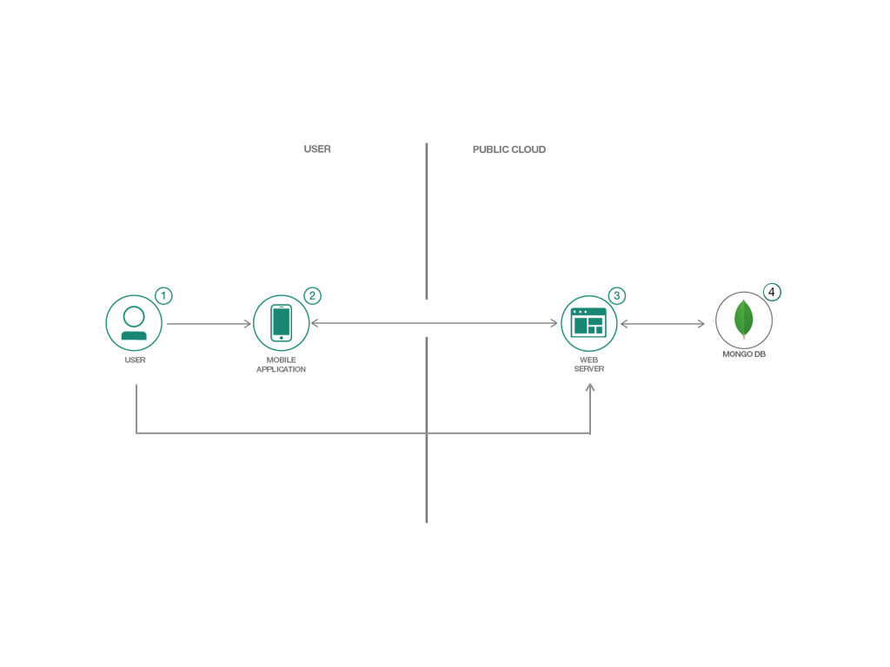
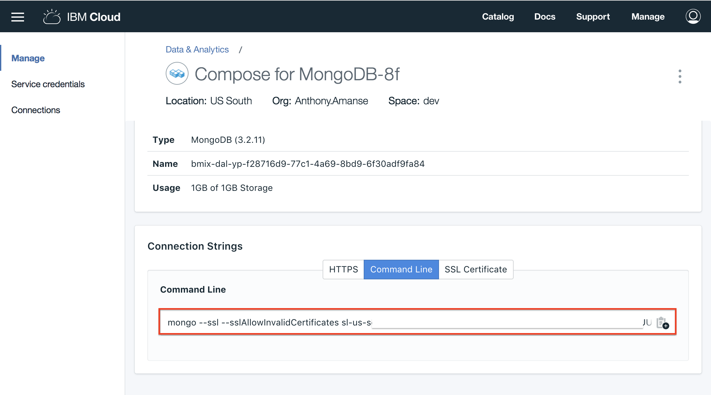
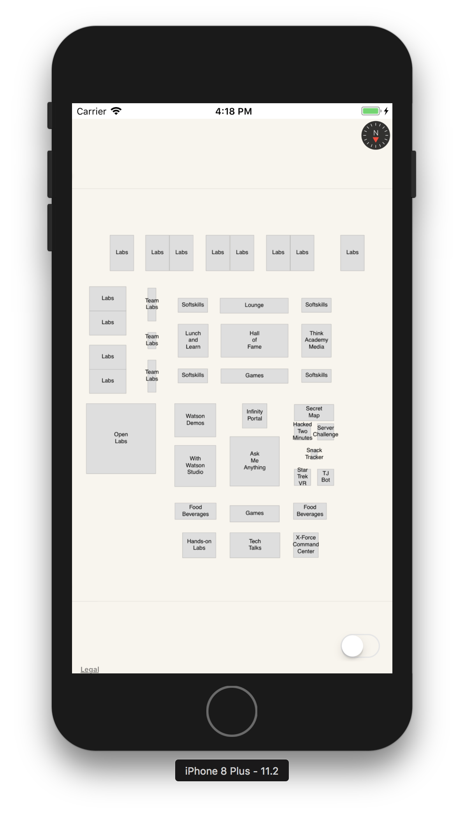
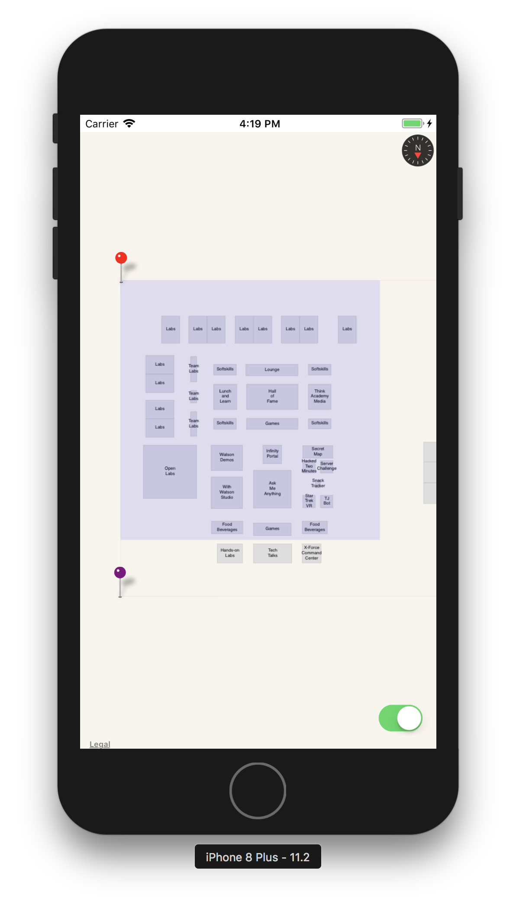
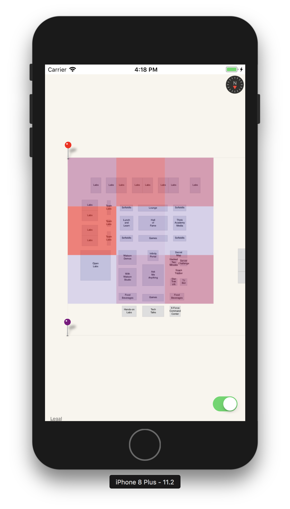

# Using MapKit to create a Dynamic Indoor Map
In this Code Pattern, we will create an indoor map using Apple's MapKit framework and a Cloud Foundry app for the iOS app's backend. The iOS app will use the existing framework MapKit to display the map while the Cloud Foundry app will generate a PDF file of an indoor map which is consumed by the iOS app. With the use of a backend data that is separate from the iOS app, developers would not need to keep updating their iOS app if they want to modify their indoor map's floor plan. This app extends the sample code in [Footprint: Indoor positioning](https://developer.apple.com/library/content/samplecode/footprint/Listings/Swift_README_md.html) from Apple.

When the reader has completed this Code Pattern, they will understand how to:

* Deploy a Cloud Foundry app
* Build an iOS map using MapKit
* Integrate the iOS map to get data from the Cloud Foundry app
* Make custom overlays with MapKit



## Flow

1. The user opens the iOS application and can toggle the heatmap on or off. The user will also generate random data of events in the zones of the indoor map. This should update the colors of the heatmap.
2. The iOS app sends requests to the backend through RESTful API.
3. The backend retrieves or updates the documents in the database. The backend would also generate the PDF based on the data received.
4. The database gets or updates the data based on the request from the server.

## Included components

* [Cloud Foundry](http://cloudfoundry.org/): Build, deploy, and run applications on an open source cloud platform.
* [Compose for MongoDB](https://console.bluemix.net/catalog/services/compose-for-mongodb): MongoDB with its powerful indexing and querying, aggregation and wide driver support, has become the go-to JSON data store for many startups and enterprises.

## Featured technologies

* [Mobile](https://mobilefirstplatform.ibmcloud.com/): Systems of engagement are increasingly using mobile technology as the platform for delivery.
* [Node.js](https://nodejs.org/): An open-source JavaScript run-time environment for executing server-side JavaScript code.

# Steps

1. [Clone the repo](#1-clone-the-repo)
2. [Create Compose for MongoDB](#2-create-compose-for-mongodb)
3. [Deploy the Cloud Foundry app](#3-deploy-the-cloud-foundry-app)
4. [Configure the iOS application](#4-configure-the-ios-application)
5. [Run the iOS application](#5-run-the-ios-application)
6. [Turn heatmap on](#6-turn-heatmap-on)

### 1. Clone the repo

```
$ git clone https://github.com/IBM/ios-mapkit-indoor-map
cd ios-mapkit-indoor-map
```

### 2. Create Compose for MongoDB

Create Compose for MongoDB and name it `heatmap-compose-mongodb`:
> It is important to have the Compose for Mongodb instance be named `heatmap-compose-mongodb` since the Cloud Foundry app will be binding to that instance name. If you have named it to a different one, modify the `heatmap-backend/manifest.yml` file.

* [**Compose for MongoDB**](https://console.bluemix.net/catalog/services/compose-for-mongodb)

After the provisioning is complete, you'll need to insert some documents in the database.
In the IBM Cloud Dashboard of the compose instance you just created, copy the Mongo command line connection string


Generate the documents using `real-data.js`. Add this filename at the end of the command line connection string
> You may need to install mongo shell if you don't have it yet

```
$ mongo --ssl --sslAllowInvalidCertificates <url> -u <user> -p <password> --authenticationDatabase admin real-data.js
```

### 3. Deploy the Cloud Foundry app

Go to `heatmap-backend` folder and push the app in Cloud Foundry in your account. After the app is pushed, you'll need to copy the app url which you will need after this step. The url will be formatted like `heatmap-backend-<random-name>.mybluemix.net`

<pre>
$ cd heatmap-backend
$ bx cf push
...
...
Showing health and status for app heatmap-backend in org Developer Advocacy / space dev as Anthony.Amanse@ibm.com...
OK

requested state: started
instances: 1/1
usage: 128M x 1 instances
<b>urls: heatmap-backend-unvillainous-washout.mybluemix.net</b>
last uploaded: Mon Mar 12 00:02:39 UTC 2018
stack: cflinuxfs2
buildpack: SDK for Node.js(TM) (ibm-node.js-6.12.3, buildpack-v3.18-20180206-1137)

     state     since                    cpu    memory      disk      details
#0   running   2018-03-11 05:04:56 PM   0.0%   0 of 128M   0 of 1G
</pre>

### 4. Configure the iOS application

Open `heatmap.xcodeproj` with Xcode. This loads all the source which you need to build the iOS app.

In `ViewController.swift`, modify the line (line 13) to use your own backend URL (CF_APP_URL in the swift file) which you just deployed in Cloud Foundry.
<pre>
...
let CF_APP_URL:String = "https://<b>heatmap-backend-unvillainous-washout.mybluemix.net</b>"
...
</pre>

### 5. Run the iOS application

Once you have modified and saved the `ViewController.swift` to use your own backend, run the app using a simulator or your own iPhone.
You should see Apple Maps using the PDF from your backend as an indoor map.


The sample debugging annotations should show you the origin (0,0) of your pdf and the anchors. The anchors are there so that the MapView will know where to place the PDF. It needs the longitude and latitude of the location of the place of your indoor map. These data are in `real-data.js` which you have inserted in MongoDB.

### 6. Turn heatmap on

With custom overlays and the data from the backend, you could create a heatmap over your indoor map. You can turn on the heatmap using the toggle at the bottom right corner of the app.



You'll see that the app will render some overlays above the indoor map. To update the data from the backend, use `random.js` to generate random data which should change colors of the overlay depending on the number of events from each zone. The overlays will update every 5 seconds when the toggle is on.
> random.js is in the root directory of this repo

<pre>
<b>Use the URL of your own Cloud Foundry app</b>

$ export CF_APP_URL="<b>https://heatmap-backend-unvillainous-washout.mybluemix.net</b>"
$ npm install
$ node random.js

Sending 6 number of events to zone: 8
Sending 5 number of events to zone: 5
Sending 9 number of events to zone: 1
Sending 10 number of events to zone: 3
...
</pre>

In a real setting, the iOS app can be used to trigger these events.



# Links

* [MapKit](https://developer.apple.com/documentation/mapkit)
* [Footprint: Indoor positioning](https://developer.apple.com/library/content/samplecode/footprint/Listings/Swift_README_md.html)

# Learn more

* **Mobile Code Patterns**: Enjoyed this Code Pattern? Check out our other [Mobile Code Patterns](https://developer.ibm.com/code/technologies/mobile/).
* **Node.js Code Patterns**: Enjoyed this Code Pattern? Check out our other [Node.js Code Patterns](https://developer.ibm.com/code/technologies/node-js/).

# License
This code pattern is licensed under the Apache Software License, Version 2. Separate third party code objects invoked within this code pattern are licensed by their respective providers pursuant to their own separate licenses. Contributions are subject to the Developer [Certificate of Origin, Version 1.1](https://developercertificate.org/) (“DCO”) and the [Apache Software License, Version 2](LICENSE).
ASL FAQ link: http://www.apache.org/foundation/license-faq.html#WhatDoesItMEAN
